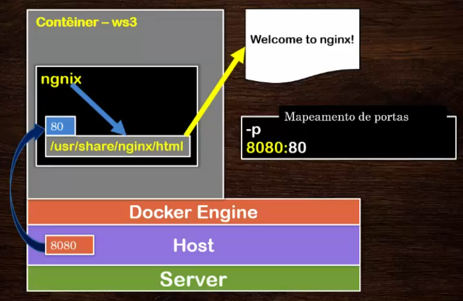
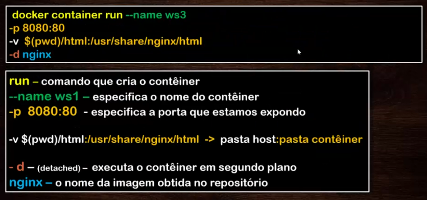
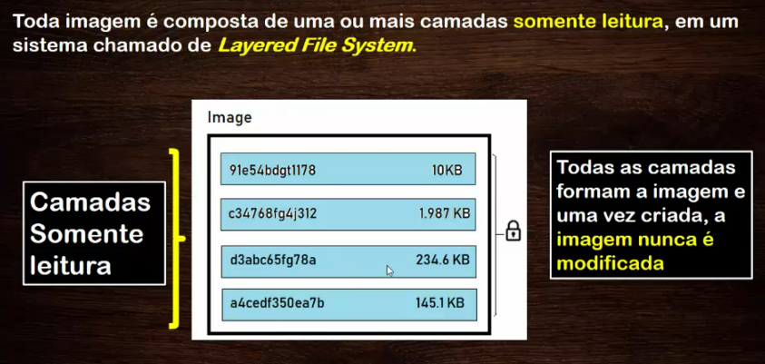
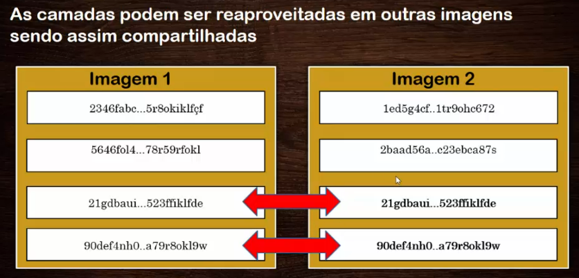
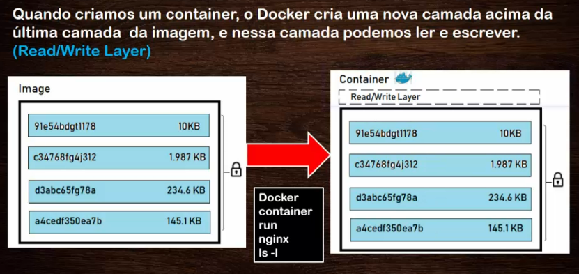
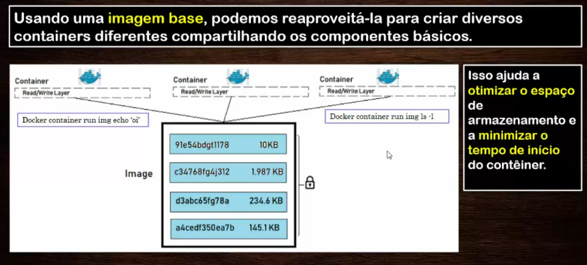

# Docker essencial para a plataforma .NET

Verificar o docker:

```
docker --version
```

Para usar o docker sem o sudo:

```
sudo groupadd docker

sudo gpasswd -a <usuario> docker

sudo service docker restart

newgrp Docker
```

# Containers

## Criar um container

```
docker container run <imagem>
```

Explicando o comando acima:

- docker
é o executor do comando.

- container
indica que o comando vai atuar em um container.

- run
é a porta de entrada no Docker e realiza 4 operações.
    - Baixa a imagem não encontrada localmente: `docker image pull`
    - Cria o container: `docker container create`
    - Inicializa o container: `docker container start`
    - Uso do modo interativo executa um comando: `docker container exec`
    
Para que um contêiner seja excluído assim que ele for executado usamos a flag `--rm` no comando da criação do contêiner:

```
Docker container run --name teste --rm -it alpine:3.8
```


## Visualizar os containers

```
docker container ps

docker container ps -a
```

Visualizar as imagens

```
docker images
```

## Criar container com comandos

Para criar um container, usamos o comando:

```
docker container run <imagem> <comando>
```

Para baixar uma imagem do repositório do dockerhub:

```
docker image pull <imagem>
```

Exemplo: `docker image pull alpine`

Se quisesse com versão específica: `docker image pull alpine:3.6` ou `docker image pull alpine:latest`

## Usando o comando

Exemplo:

```
docker container run alpine ls -l
```

Ele vai executar o container, executar o comando e sair do container.

## Modo interativo e com terminal

Exemplo:

```
docker container run -it alpine /bin/sh
```

Usamos acima dois argumentos, o "i" e o "t", onde:

- i: interativo
- t: terminal

E o shell é o sh.

Veja que cada **execução** é feita em um **container separado** que tem um sistema de arquivos separado e é executado em um **namespace** diferente.

Um container **não** tem como **interagir** com outros containeres mesmo que sendo da mesma imagem.

## Reutilizar um container

Exemplo:

```
docker container start eaf6
```

Pode usar o código completo gerado do container, ou o nome do container, no comando acima. No caso de usar o código do container, basta os 4 primeiros dígitos.

O container vai estar em execução e pode ser verifica com o comando: `docker container ps`

Pode usar também um comando dentro dele com o comando: `docker container exec eaf6 ls -l` que executará o comando ls -l.

## Parando um container

```
docker container stop competent_robinson
```

## Criando um container com nome

```
docker container run --name leonardo alpine
```

## Removendo um container

```
docker container rm macoratti
```

## Mapeando portas

Exemplo com a imagem do nginx:

```
docker container run --name ws1 -p 8080:80 nginx
```

8080 é a porta que vai ser acessada de fora do container.
80 é a porta interior do container, é a porta padrão do nginx, que ele atende.

Da maneira anterior, ele vai executar o container e travar o terminal, onde teríamos que dar um crtl+C para finalizar.



Para criar um container que ficará em background:

```
docker container run --name ws2 -p 8080:80 -d nginx
```

-d é detached. Executa em background.

## Mapeando diretórios para um container

Exemplo, criando uma pasta html no diretório atual e mapeando a porta do html do nginx para esta pasta.

```
docker container run --name ws3 -p 8080:80 -v $(pwd)/html:/usr/share/nginx/html -d nginx
```



Para vermos os detalhes desta montagem, podemos usar o comando:

```
docker container inspect ws3
```

## Usando um container com .NET Core

Exemplo:

```
docker container run --name demonet -it mcr.microsoft.com/dotnet/sdk:2.1
```

Com o comando acima vamos entrar no container no modo interativo com terminal. Podemos sair do container digitando exit.

Para voltar ao container:

```
docker container start -ia demonet
```

## Remover todos os containers

```
docker container prune
```

Este comando acima vai remover todos os containers parados. Cuidado.

## Remover a imagem

```
docker image rm <id>

docker image prune
```

O prune apaga todas as imagens que não estão em uso.

Outra maneira interessante:

```
docker image $(docker image ls -a -q)
```

# Imagens

Uma **imagem do Docker** é um binário que inclui todos os requisitos para a **criação e execução** de um **unico container do Docker**, bem como os metadados que descrevem suas necessidades e capacidades, incluindo o código do aplicativo dentro do container e suas configurações.









## Como criar imagens

Há duas maneiras de criarmos imagens, com o Dockerfile ou commit. O Commit não é recomendável.

O **Dockerfile** é um arquivo com texto com isntruções, comandos e passos que é executado através do comando *build* para gerar uma imagem.

```
docker build -t <imagem>
```

Exemplo: Criar uma imagem do **debian 8** que instale e inicie o servidor **nginx**.

Definindo as etapas que vamos usar para criar a imagem:

- Definir uma imagem base.
- Definir informações para a imagem.
- Executar comandos para instalar e iniciar o nginx.
- Expor qual porta o servidor vai atender (no container).
- Definir o ponto de entrada da aplicação.
- Definir a execução de um comando para inicializar o servidor nginx.


### Passo a passo

Criar o arquivo Dockerfile.

Ele atua com o build dentro do diretório e seus sub diretórios, não é boa ideia colocá-lo na raiz.

```
FROM debian:8
LABEL version="1.0" description="Debian/Nginx"
RUN apt-get update && apt-get install -y nginx --force-yes && apt-get clean
EXPOSE 80
ENTRYPOINT ["/usr/sbin/nginx"]
CMD ["-g", "daemon off;"]
```

Acima, o comando FROM pega a imagem debian versão 8.
O LABEL define as informações da imagem.
o RUN determina os comando a serem executados, no caso, instalar o nginx no Debian.
EXPOSE expõe a porta 80, a porta do nginx.
O ENTRYPOINT define a pasta de entrada, onde a aplicação vai ser executada.
O CMD é o comando que será executado no servidor.

O comando que vai ser executado no CMD vai ser esse: `/usr/sbin/nginx -g daemon off`

Agora resta criar a imagem com o docker build.

```
docker build -t leorv/debian8-nginx:1.0 .
```

O ponto final significa o diretório atual, no caso, onde tem o Dockerfile.

Testando:

```
docker container run -d -p 8080:80 --name=ws1 leorv/debian8-nginx:1.0
```

Daí pode dar um `docker login` e um `docker push` para subir a imagem pra conta.

### Inspecionar a imagem

```
docker image inspect leorv/debian8-nginx:1.0

docker image history leorv/debian8-nginx:1.0
```

### Criar um alias através da tag da imagem

```
docker image tag redis:latest redis:leo
```

### Criar uma imagem através de um Dockerfile

```
docker image build <Dockerfile>
```

